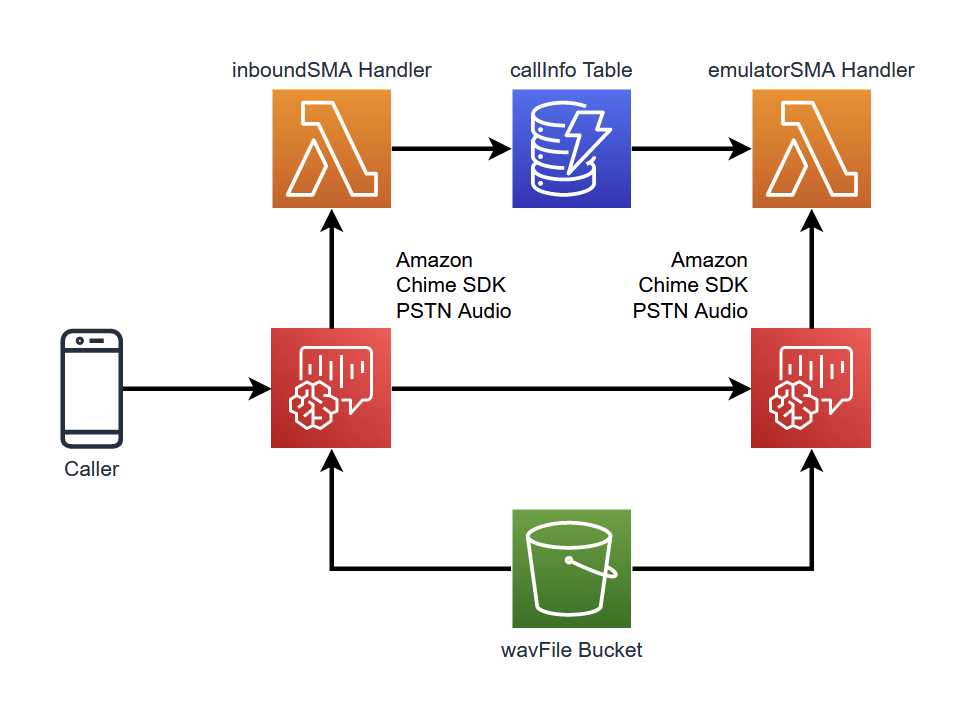

# Bridging Call with Amazon Chime SIP Media Applications

This demo will build and configure several services within AWS so that you can bridge a call from one Amazon Chime SIP media application to another to create a simple Interactive Voice Response (IVR).

## Overview



## Requirements

- node V12+/npm [installed](https://www.npmjs.com/get-npm)
- yarn [installed](https://yarnpkg.com/getting-started/install)
- Ability to create a Chime SIP media applications and Phone Numbers (ensure your [Service Quota](https://console.aws.amazon.com/servicequotas/home/services/chime/quotas) in us-east-1 for Phone Numbers have not been reached)
- Deployment must be done in us-east-1 or us-west-2 to align with SIP media application resources

## How It Works

In this demo, you will be creating two Chime SIP media applications to construct a simple IVR. The first SMA, `inboundSMA.js` is created and associated with a phone number `inboundPhoneNumber`. The second SMA, `emulatorSMA.sj` is created and associated with two phone numbers: `salesPhoneNumber` and `supportPhoneNumber`. The Emulator SMA will act as a simple telephony device that answers the inbound call and plays a message.

When a call is placed to the `inboundPhoneNumber` and answered by the `inboundSMA` Amazon Chime SIP media application, it will invoke the `inboundSMA.js` AWS Lambda function. This will have an `InvocationEventType` of `NEW_INBOUND_CALL`. This will cause the following code to be used:

```javascript
async function newCall(event) {
  const callInfo = await getCaller(event.CallDetails.Participants[0].From);
  if (callInfo === false) {
    console.log('Do not know this phone number.  Getting Account ID');
    playAudioAndGetDigitsAction.Parameters.MinNumberOfDigits = 5;
    playAudioAndGetDigitsAction.Parameters.MaxNumberOfDigits = 5;
    playAudioAndGetDigitsAction.Parameters.AudioSource.Key = 'greeting.wav';
    return [playAudioAndGetDigitsAction];
  } else {
    console.log('Know this phone number.  Sending Prompt');
    speakAction.Parameters.Text =
      "<speak>Your account ID is <say-as interpret-as='digits'>" +
      callInfo.accountId +
      '</say-as>.</speak>';
    'Your account ID is ' + callInfo.accountId;
    playAudioAndGetDigitsAction.Parameters.MinNumberOfDigits = 1;
    playAudioAndGetDigitsAction.Parameters.MaxNumberOfDigits = 1;
    playAudioAndGetDigitsAction.Parameters.AudioSource.Key = 'prompt.wav';
    return [speakAction, playAudioAndGetDigitsAction];
  }
}
```

This code will look up the caller's phone number in the `callerInfo` Amazon DynamoDB table associated with the application. If the phone number is found in the table, it will return a `true` value and the Amazon Chime SDK SIP media application will return an action to the caller that reads the caller their account id and prompts them to `Press 1 for sales or 2 for support` using the `playAudioAndGetDigitsAction` and the `prompt.wav` file in the `wavFiles` bucket. If the phone number is NOT found, the Amazon Chime SDK SIP media application will return an account to get the callers account ID using the `playAudioAndGetDigitsAction`. When the caller enters their five digit account ID and the Amazon Chime SDK SIP media application is invoked again, the account ID will be stored in the DynamoDB table using the caller's phone number as the primary key.

Once the caller has entered digits to select between Sales and Support, this information will be stored in the DynamoDB table and the call will be bridged to either the Sales or Support number. This demo uses the `CallAndBridge` action to connect the call to another phone number.

```javascript
if (event.ActionData.ReceivedDigits === '1') {
  console.log('Transferring to Sales');
  playAudioAction.Parameters.AudioSource.Key = 'transfer-to-sales.wav';
  callAndBridgeAction.Parameters.CallerIdNumber =
    event.CallDetails.Participants[0].From;
  callAndBridgeAction.Parameters.Endpoints[0].Uri = salesNumber;
  callInfo.extension = 'sales';
  await updateCaller(callInfo);
  return [playAudioAction, callAndBridgeAction];
} else {
  console.log('Transferring to Support');
  playAudioAction.Parameters.AudioSource.Key = 'transfer-to-support.wav';
  callAndBridgeAction.Parameters.CallerIdNumber =
    event.CallDetails.Participants[0].From;
  callAndBridgeAction.Parameters.Endpoints[0].Uri = supportNumber;
  callInfo.extension = 'support';
  await updateCaller(callInfo);
  return [playAudioAction, callAndBridgeAction];
}
```

Depending on the digits entered, the call will be bridged to either the `salesNumber` or `supportNumber` using the `CallAndBridge` action:

```javascript
const callAndBridgeAction = {
  Type: 'CallAndBridge',
  Parameters: {
    CallTimeoutSeconds: '20',
    CallerIdNumber: '',
    Endpoints: [
      {
        Uri: '',
        BridgeEndpointType: 'PSTN',
      },
    ],
  },
};
```

When the call is answered on the `emulator` Amazon Chime SDK SIP media application, a response is played to the caller depending on if Sales or Support was selected in the `inboundSMA` Amazon Chime SDK SIP media application.

## Deployment

```bash
git clone https://github.com/aws-samples/amazon-chime-sma-bridging
cd amazon-chime-sma-bridging
yarn launch
```

## Resources Created

- Three Lambda Functions
  - inboundSMA Lambda: Used to process inbound calls with Chime SMA
  - emultatorSMA Lambda: Used to emulate a PBX or IVR and take incoming calls from the inboundSMA Lambda
- Three Chime SIP Media application rules
  - inbound SMA rule with phone number
  - emulator SMA rule with phone number for sales
  - emulator SMA rule with phone number for support
- Two Chime SIP media applications
  - inbound SMA pointing to inboundSMA Lambda
  - emulator SMA pointing to emulatorSMA Lambda
- One DynamoDB used to store information when passing between SIP media applications
- One S3 Bucket used to store wav files for play on SIP media applications

## Cleanup

To clean up this demo, please use `yarn cdk destroy` or delete the stack in CloudFormation. A

## Security

See [CONTRIBUTING](CONTRIBUTING.md#security-issue-notifications) for more information.

## License

This library is licensed under the MIT-0 License. See the LICENSE file.

## Topics

Programmable Voice, Voice APIs, SIP media application, Amazon Chime SDK, Amazon Polly
