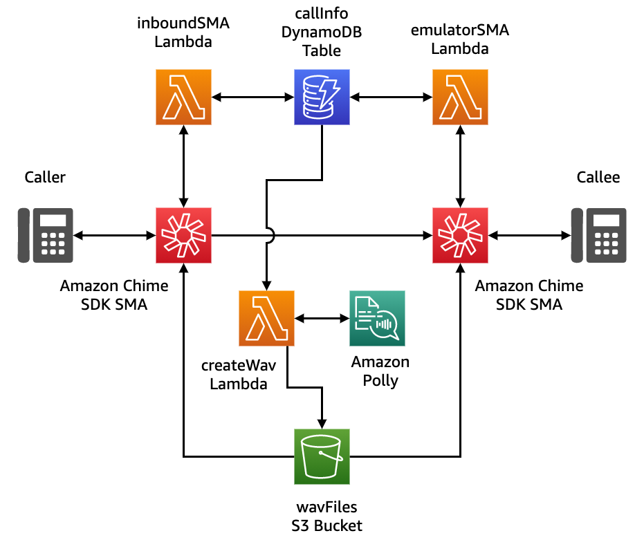

# Bridging Call with Amazon Chime SIP Media Applications

This demo will build and configure several services within AWS so that you can bridge a call from one Amazon Chime SIP media application to another to emulate an IVR.

## Overview

## Requirements

- node V12+/npm [installed](https://www.npmjs.com/get-npm)
- yarn [installed](https://yarnpkg.com/getting-started/install)
- AWS CLI [installed](https://docs.aws.amazon.com/cli/latest/userguide/install-cliv2.html)
- Ability to create a Chime SIP media applications and Phone Numbers (ensure your [Service Quota](https://console.aws.amazon.com/servicequotas/home/services/chime/quotas) in us-east-1 for Phone Numbers have not been reached)
- Deployment must be done in us-east-1 or us-west-2 to align with SIP media application resources

## Deployment

- Clone this repo: `git clone https://github.com/aws-samples/amazon-chime-sma-bridging`
- `cd amazon-chime-sma-bridging`
- `./deploy.sh`

## Resources Created

- Three Lambda Functions
  - inboundSMA Lambda: Used to process inbound calls with Chime SMA
  - emultatorSMA Lambda: Used to emulate a PBX or IVR and take incoming calls from the inboundSMA Lambda
  - createWav Lambda: Used to create wav files from Polly and store in S3 for SMA lambdas to use as audio source
- Three Chime SIP Media application rules
  - inbound SMA rule with phone number
  - emulator SMA rule with phone number for sales
  - emulator SMA rule with phone number for support
- Two Chime SIP media applications
  - inbound SMA pointing to inboundSMA Lambda
  - emulator SMA pointing to emulatorSMA Lambda
- One DynamoDB used to store information when passing between SIP media applications
- One S3 Bucket used to store wav files for play on SIP media applications

## Operation

In this demo, you will be creating two Chime SIP media applications. The first SMA, `inboundSMA.js` is created and assocaited with a phone number `inboundPhoneNumber` that is part of the CDK output. The second SMA, `emulatorSMA.sj` is created and associated with two phone numbers: `salesPhoneNumber` and `supportPhoneNumber`. The Emulator SMA will act as a simple telephony device that answers the inbound call and plays a message.

To test this out, from a normal phone, place a call to the `inboundPhoneNumber`. The `inboundSMA` will first check to see if the calling number has an assocaited account ID. If it does, it plays a message and requests a DTMF response of '1' for sales or '2' for support. Once a selection has been made, this SMA will bridge the call to the associated number on the the `emulatorSMA`. If the number is not assocaited with an account, the SMA will request the account ID and store that account ID in a DynamoDB. This store will trigger a Lambda to create a wav file for later playback.

When the call arrives on the `emulatorSMA`, it will look up the number on the incoming call and get the associated account ID. It will then play the account number back to the caller and hangup.

## Cleanup

To clean up this demo, please use `npx cdk destroy` or delete the stack in CloudFormation. Additionally, phone numbers and SIP media application should be removed from the Chime console manually.

## Security

See [CONTRIBUTING](CONTRIBUTING.md#security-issue-notifications) for more information.

## License

This library is licensed under the MIT-0 License. See the LICENSE file.

## Topics

Programmable Voice, Voice APIs, SIP media application, Amazon Chime SDK, Amazon Polly
